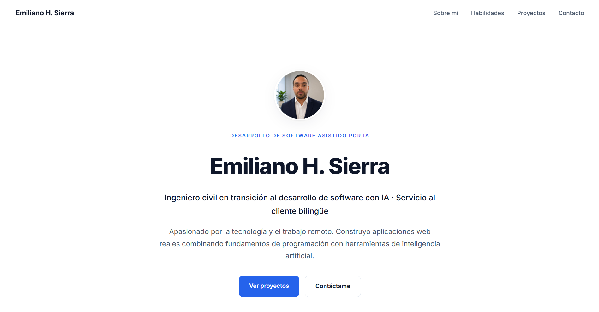

<h1 align="center">Emiliano Lizarraga — Developer Portfolio</h1>

<p align="center">
  A personal portfolio showcasing my profile, technical skills, and live AI-assisted projects.
</p>

<p align="center">
  
  
  
  
  
</p>

<p align="center">
  
</p>

<p align="center">
  <a href="https://emilianohsierra.vercel.app"><b>Live Site →</b></a>
</p>

---

## Overview

A fast, responsive personal portfolio built with vanilla HTML, CSS, and JavaScript, and deployed on Vercel. It presents my background, technical skills, and links to live projects — including an AI-powered customer-support assistant.

---

## Sections

- **About** — background and current focus on AI-assisted development
- **Skills** — technical and professional strengths
- **Projects** — live, deployed work with links
- **Contact** — email and professional links

---

## Tech Stack

| Technology | Purpose |
|------------|---------|
| HTML5 | Structure and semantics |
| CSS3 | Styling and responsive layout |
| JavaScript | Interactive components |
| Vercel | Hosting and continuous deployment |

---

## Featured Project

**AI Customer Support Assistant** — a full-stack AI app (Claude API + serverless) that drafts professional, bilingual support replies.
[Live Demo](https://asistente-virtual-livid.vercel.app) · [Repository](https://github.com/emilianohsierra/Asistente-Virtual)

---

## Run Locally

```bash
git clone https://github.com/emilianohsierra/emilianohsierra.git
cd emilianohsierra
```

Open `index.html` in your browser, or deploy on [Vercel](https://vercel.com) for a live URL.

---

## Author

**Emiliano Lizarraga** — AI-Assisted Developer
Portfolio: https://emilianohsierra.vercel.app · GitHub: https://github.com/emilianohsierra

---

## License

Released under the MIT License. See [`LICENSE`](LICENSE) for details.
